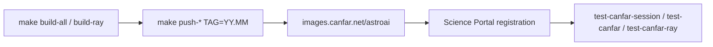
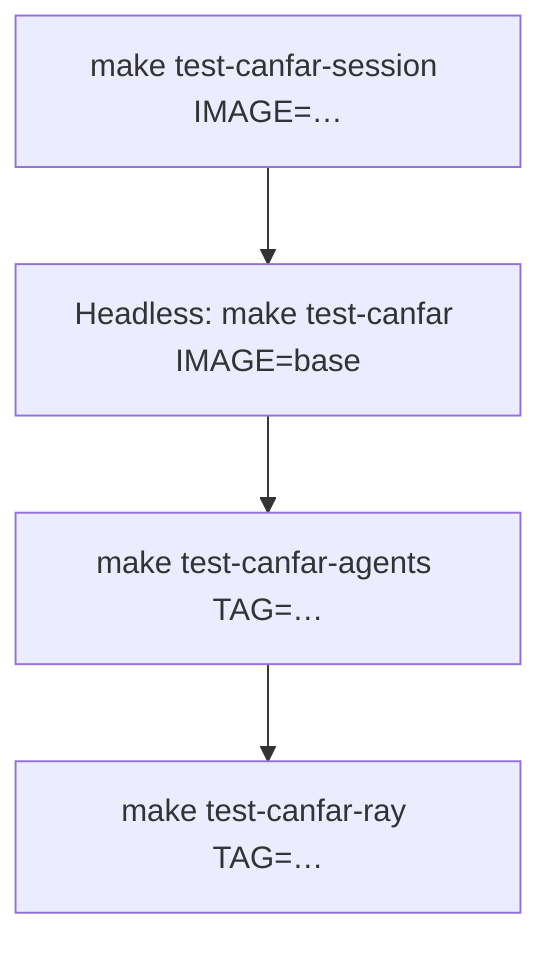

# Operators guide

For **AstroAI maintainers** who build, push, and register
`images.canfar.net/astroai/*` on the CANFAR Science Platform.

Skaha Helm charts and launch scripts live in
[opencadc/science-platform](https://github.com/opencadc/science-platform)
(platform team). This repo owns image build/push and Science Portal registration
inside the Harbor project **`astroai`**.

| Role | Scope |
|------|--------|
| **AstroAI maintainer** | Build, push, register, smoke-test images |
| **CANFAR platform admin** | Skaha Helm, ingress, launch ConfigMaps |



## Images and session types

| Image | Harbor path | Skaha type | Port | Portal? |
|-------|-------------|------------|------|---------|
| `base` | `…/astroai/base:<tag>` | — | — | No (parent / headless verify) |
| `webterm` | `…/astroai/webterm:<tag>` | Contributed | 5000 | Yes |
| `ghostty-web` | `…/astroai/ghostty-web:<tag>` | Contributed | 5000 | Yes |
| `vscode` | `…/astroai/vscode:<tag>` | Contributed | 5000 | Yes |
| `notebook` | `…/astroai/notebook:<tag>` | Notebook | 8888 | Yes |
| `marimo` | `…/astroai/marimo:<tag>` | Contributed | 5000 | Yes |
| `openresearch` | `…/astroai/openresearch:<tag>` | Contributed | 5000 | Yes |
| `ray-manager` | `…/astroai/ray-manager:<tag>` | Contributed | 5000 | Yes |
| `ray-worker` | `…/astroai/ray-worker:<tag>` | Headless | — | No — manager launches |
| `improc` | `…/astroai/improc:<tag>` | Headless | — | Optional (batch) |
| `improc-webterm` | `…/astroai/improc-webterm:<tag>` | Contributed | 5000 | Yes |
| `improc-notebook` | `…/astroai/improc-notebook:<tag>` | Notebook | 8888 | Yes |

OCI label `io.canfar.skaha.session.type` marks `headless` / `contributed` / `notebook`.

Register **`ray-manager` only** for Ray. Workers stay headless. See [RAY.md](RAY.md).
Register **`improc-webterm`** (Contributed) and **`improc-notebook`** (Notebook);
leave **`improc`** headless for batch. Build/push: `make build-improc` /
`make push-improc`.

Users authenticate once with `canfar login` (credentials under `/arc/home`,
`~/.canfar/config.yaml`). Ray manager sessions reuse that home volume.

## Harbor (`astroai` public project)

Images: `images.canfar.net/astroai/<image>:<tag>`. Keep project **Public** so
anonymous pull works for portal users.

```bash
docker logout images.canfar.net 2>/dev/null || true
docker pull images.canfar.net/astroai/base:latest
```

Push still requires `docker login images.canfar.net`.

Build and publish:

```bash
# BUILD_TAG must match TAG so ray-manager bakes RAY_IMAGE_TAG for workers
make build-all BUILD_TAG=26.09
make push-all TAG=26.09 BUILD_TAG=26.09
make build-ray BUILD_TAG=26.09 TAG=26.09
make push-ray TAG=26.09 BUILD_TAG=26.09
```

Each `push/<image>` publishes `TAG` and **`latest`**. `make push-all` includes
`base`. Prefer monthly **`YY.MM`** tags in production docs.

## Platform boundary

| Session type | Helm template | Container command | AstroAI `/skaha/startup.sh` |
|--------------|---------------|-------------------|-----------------------------|
| **Contributed** | `launch-contributed.yaml` | Image `CMD` | Yes |
| **Notebook** | `launch-notebook.yaml` | Platform `/skaha-system/start-jupyterlab.sh` by default | Only with platform override |
| **Headless** | `launch-headless.yaml` | User command / image `CMD` | Image-dependent |

Contributed ingress strips `/session/contrib/<session-id>` before the container.
Session UIs listen at `/` on port **5000**.

| Image | Proxy / listen notes |
|-------|----------------------|
| `webterm` | Listen `/` — no ttyd `--base-path` |
| `ghostty-web` | Listen `/` — relative `./client.mjs`, `./dist/*`, WebSocket under session path |
| `vscode` | `--server-base-path /session/contrib/<id>` for URL generation |
| `marimo` | Listen `/` — **no** `--base-url`; HTML proxy on :5000 sticks session name in tab |
| `notebook` | Ingress keeps path; Jupyter `base_url=session/notebook/<id>`; `appName` = session name |
| `openresearch` | Path-rewrite proxy on :5000 + HTML title stick |
| `ray-manager` | Server-rendered HTML `<title>` = session name |

**Browser tab title:** Skaha sets the pod `hostname` to the session name (lowercase).
AstroAI images read it via `socket.gethostname()` (`scripts/lib/session_title.py`).

| Mechanism | Images |
|-----------|--------|
| ttyd `titleFixed` | `webterm`, `improc-webterm` |
| `ASTROAI_TAB_TITLE` + stick script | `ghostty-web` |
| VS Code `window.title` | `vscode` |
| JupyterLab `page_config.json` `appName` | `notebook`, `improc-notebook` |
| `astroai-html-proxy.py` | `marimo` |
| `orx-canfar-proxy.py` / agent wizard | `openresearch` |
| FastAPI HTML template | `ray-manager` |

Platform stock sessions (**CARTA**, **Firefly**, **desktop**) use third-party
images; tab titles are app-defined unless those images honor pod hostname.
Contributed AstroAI images above cover the interactive catalog operators register.

### Notebook override (platform request)

Stock notebook Jobs skip AstroAI `startup-notebook.sh`. To run the AstroAI
entrypoint, ask the science-platform team for a per-image override that sets
`command: ["/skaha/startup.sh"]` and passes the session id as `args` (port 8888).

## Science Portal checklist

1. Push `images.canfar.net/astroai/*:<tag>` (sessions + Ray + improc stack).
2. Register Contributed: `webterm`, `ghostty-web`, `vscode`, `marimo`, `openresearch`, `ray-manager`, `improc-webterm` → port **5000**.
3. Register Notebook: `notebook`, `improc-notebook` → port **8888**.
4. Leave `base`, `ray-worker`, and `improc` (headless) off the interactive catalog (or list `improc` under headless only). `python` and `ray-base` are bake-only, never Harbor images.
5. Document the published tag for users (`YY.MM`).
6. Smoke: `make test-canfar-session IMAGE=webterm TAG=…`, `IMAGE=ghostty-web`, `IMAGE=openresearch`, `IMAGE=improc-webterm`, and `make test-canfar-ray TAG=…`.
7. **Agent verbs:** `make test-canfar-agents TAG=…` (lightweight in-session probe of the full agent verb surface — required after every image push; see below).

## Local smoke

```bash
make build/webterm
./scripts/test-local.sh webterm 5000
make build/notebook
./scripts/test-local.sh notebook 8888
```

## Post-push verification on CANFAR

Requires authenticated [`canfar`](https://opencadc.github.io/canfar/) (`canfar login`).



**Interactive HTTP smoke** (works when headless scheduling is unhealthy):

```bash
make test-canfar-session IMAGE=webterm TAG=26.09
make test-canfar-session IMAGE=ghostty-web TAG=26.09
make test-canfar-session IMAGE=vscode TAG=26.09
make test-canfar-session IMAGE=marimo TAG=26.09
make test-canfar-session IMAGE=notebook TAG=26.09
make test-canfar-session IMAGE=openresearch TAG=26.09
```


**OpenResearch notes:** Image installs the pinned upstream [alphaXiv](https://github.com/alphaXiv/openresearch-cli) musl release (`ORX_VERSION` + `ORX_SHA256` in the Dockerfile; the Ray Jobs backend ships upstream since v0.1.88). Startup defaults compute to Ray when a manager Jobs URL is already known; the AstroAI hub **Start batch compute** button ensures an autoscaling ray-manager and wires OpenResearch. Bump `ORX_VERSION`/`ORX_SHA256` together on upstream releases. See [USAGE.md](USAGE.md).

**Agent auto-setup:** UI kinds (`openresearch`, `vscode`) default `ASTROAI_LAB_AGENT_SETUP=bg` when unset. **Marimo** stays opt-in for full setup (startup still runs `agent setup marimo` only). Webterm and ghostty-web stay opt-in. Failures never block the main UI; see `~/.astroai/lab/agent-setup.log`.

**Home quota readings:** Prefer CephFS xattrs over raw `df` (`astroai` `disk_usage`). `ceph.dir.rbytes` can lag after writes — expected Ceph behavior.

**Headless in-image verify** (`canfar-verify.sh`):

```bash
CANFAR_TEST_QUICK=1 make test-canfar IMAGE=base TAG=26.09
```

`test-canfar.sh` waits for completion and expects `All checks passed.` in logs.

**Agent verb-surface probe (run after EVERY image push):**

```bash
make test-canfar-agents TAG=26.09
```

Runs `canfar-verify.sh --agents` in a headless `base` session, which invokes
`canfar-verify-agents.sh --setup` — the full agent verb surface
(`setup`, `verify`, `plugins list`, registry verbs)
**without** the slow 16-tool install loop. This is the lightweight gate that
verifies agents work out of the box on CANFAR after each release; run the
full `make test-canfar IMAGE=base` (installs) plus `make test-canfar-ray`
before major releases.

This probe is **operator-invoked** — the CI workflow (`ci.yml`) is Docker-free
by design and never touches CANFAR. Treat `make test-canfar-agents` as a
required step in the release checklist, same as `test-canfar` / `test-canfar-ray`.
If status stays **Pending** with no Start Time for `CANFAR_PENDING_STUCK_SECS`
(default **120**), the script fails fast. Note: this is the documented
upstream **Skaha headless-scheduling flake**
([opencadc/science-platform#1124](https://github.com/opencadc/science-platform/issues/1124)),
**not** a concurrent-session quota lock — session quotas do not apply to
headless kinds. (See [Platform notes](#platform-notes-headless-pending).)

**Ray:**

```bash
make test-canfar-ray TAG=26.09
make test-canfar-ray-gpu TAG=26.09
```

Create ray-manager with **≥8 GiB** when exercising Ray Jobs / Dashboard (smaller
managers often OOM). Details: [RAY.md](RAY.md).

## Platform notes (headless Pending)

Intermittent Skaha **headless** sessions can remain Pending indefinitely
(Start Time / Connect URL unknown) while contributed and notebook sessions start
for the same user. That blocks `test-canfar.sh` worker probes and Ray preflight.

Tracked upstream:
[opencadc/science-platform#1124](https://github.com/opencadc/science-platform/issues/1124).

While headless is unhealthy:

1. Prefer `make test-canfar-session` for contributed/notebook gates.
2. Set `CANFAR_RAY_SKIP_PREFLIGHT=1` to exercise Ray manager UI without the probe.
3. Keep concurrent contributed/notebook sessions low. Headless kinds are
   **quota-exempt** — a stuck Pending headless job is the Skaha scheduling
   flake, not a quota lock. Prune only for hygiene, not to free quota slots.

## Diagnostics users can share

| Command / path | Use |
|----------------|-----|
| `canfar logs <session-id>` | Container stdout/stderr — look for `[astroai-boot]` breadcrumbs |
| `~/.astroai/lab/boot.log` | Same trail on `/arc/home` (still readable after the pod is gone) |
| `~/.astroai/lab/agent-setup.log` | Background `astroai agent setup` detail |
| `astroai status --json` | Quotas, projects, `canfar ps` |

Failed / crashed sessions: `canfar logs` keeps Skaha’s copy of stderr until the
session record ages out. Prefer grepping `[astroai-boot]` for `common-init:ERR`,
`session:exit rc=`, and `agent setup failed`. If the session was deleted,
`boot.log` on home is the durable copy.

## Agents and quota (operator view)

- Agents install on demand via `astroai agent install` into scratch/`ASTROAI_LAB_BIN_DIR` — prefer that over baking agent binaries into images.
- **Plugins vs skills:** images bake `astroai-lab` from `config/astroai-lab.lock`. That package's plugins are **MCP / tools / rules only**. Skill packs (`SKILL.md`) install via `npx skills add astroai/canfar-skills` (skills.sh), not `astroai agent plugins`.
- **Release order:** merge/push `astroai-lab` first → `make lock-astroai-lab` here → rebuild/push images. Skipping the lock leaves Harbor on an older lab that still managed skills as plugins.
- Quota warnings fire at session start and via `astroai status` (≈80 / 90 / 95%).
- User data lifecycle (`astroai save`, `canfar data`) is documented for users in [USAGE.md](USAGE.md).

## User-facing docs

Point end users at [USAGE.md](USAGE.md) (also `/opt/astroai/USAGE.md` in sessions).
